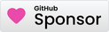

# Camera based skew calibration for Klipper

Camera-based XY skew calibration for Klipper using a toolhead-mounted camera and a ChArUco board. Fast, repeatable, and automated.

## ▶️ Video walkthrough

Please watch this Video where I explain the project: 

[](https://youtu.be/WQilddTZJRA)

## ⚠️ Disclaimer

Early version. Verify results and keep hands clear while the printer moves. Use at your own risk.

## ✨ Features

- Automated Klipper XY skew calibration with a camera and ChArUco board
- Works with Moonraker and HTTP/MJPEG cameras (e.g. crowsnest)
- Stores camera intrinsics to K.npy and dist.npy for reuse
- Prints ready-to-use Klipper command: SET_SKEW XY=...
- Reports observed axis travel for a commanded 100 mm move and if a significant scale error is detected, prints suggested rotation_distance correction factors for X/Y

## 🧠 How it works

1) Board: Print or use the provided PDFs and tape the ChArUco board flat on the bed (100% scale, no fit-to-page).
2) Guided capture: The tool moves the toolhead and captures images at multiple XY offsets and Z heights to diversify perspective for robust calibration.
3) Intrinsics: OpenCV (CharucoDetector) detects corners across images and calibrates the camera, saving K.npy and dist.npy.
4) Skew solve: With the calibrated camera, the tool collects poses across the bed, estimates the camera–nozzle offset and an affine map from commanded XY to observed board XY, then emits SET_SKEW parameters for Klipper.
  Additionally, it reports observed axis travel for a 100 mm and when the error is significant, prints rotation_distance correction hints for X and Y.

## 📦 Requirements

- Python 3.8+ (Linux recommended)
- Klipper + Moonraker reachable from your host
- A camera reachable via HTTP snapshot/MJPEG (typical crowsnest URL) or a local index supported by OpenCV
- OpenCV: opencv-python>=4.10

Optional (for PDF generation only): Pillow, img2pdf, pikepdf

## 🛠️ Install

- Create/activate a venv if desired, then install:
```bash
pip install -r requirements.txt
```

## 🚀 Quick start

1) Print the ChArUco board (recommended)

- Open and print either `charuco_A4_5mm.pdf` or `charuco_Letter_5mm.pdf` depending on your paper size.
- Print at 100% scale (Actual Size). Do not use "Fit to page". Tape the sheet flat and square to the bed.
- You do NOT need to run `generate-board` unless you want to regenerate these PDFs yourself.

Optional (regenerate PDFs yourself — requires extras):

```bash
skew_correction.py generate-board
```

Experimental: Bambu Lab Vision Encoder board

- You can also try using the original Bambu Lab Vision Encoder board (untested).
- It uses a custom 7x7 ArUco dictionary and has small 2.5 mm fields on a 132×128 grid.
- This may require a higher-resolution camera and/or the ability to focus very close.
- Usage:

```bash
# One-time intrinsics (experimental mode):
skew_correction.py calibrate-camera "camera_calibration_imgs/*.jpg" --vision-encoder

# Run skew (experimental mode):
skew_correction.py skew --z 40 --vision-encoder
```

2) Capture images for camera intrinsics (one-time setup)

This moves the toolhead through a guided pattern to capture multiple views and saves images to `camera_calibration_imgs/`. Do this once per camera setup, and only repeat if you change focus, resolution, lens, or the camera mount. Adjust `--camera-id` if your camera URL or index differs.

```bash
skew_correction.py capture-calibration-images \
  --camera-id http://klipper.local/webcam/?action=snapshot
```

3) Calibrate intrinsics and save K.npy / dist.npy (one-time setup)

This reads the captured images, detects ChArUco corners, and computes camera intrinsics. It writes `K.npy` and `dist.npy` for reuse. You typically do this once; future `skew` runs will reuse these files.

```bash
skew_correction.py calibrate-camera "camera_calibration_imgs/*.jpg"
```

4) Run skew calibration and print the Klipper command (repeat as needed)

This captures poses over the bed, estimates camera–nozzle offset and XY skew, and prints a ready-to-use Klipper command like `SET_SKEW XY=...`. Run this whenever you want to re-check or update skew; it reuses `K.npy` and `dist.npy`.

```bash
skew_correction.py skew --z 40
```

Defaults can be overridden with flags or env vars (see below).

When skew completes, the tool also:
- Reports the observed travel for a 100 mm command along X and Y (assuming the board is printed at 100% scale)
- If the axis scale error is significant, prints a hint with suggested correction factors:
  - Klipper: new rotation_distance = old rotation_distance × factor (per-axis)

Note on one-time vs recurring steps:
- Steps 2–3 (intrinsics capture and calibration) are one-time per camera configuration.
- Step 4 (`skew`) is what you run each time you want updated skew values.

## 🔧 Command reference

- Regenerate board PDFs (A4, Letter) alteratively use Bambu Vision Encoder board (experimental):
  - `skew_correction.py generate-board`
  - Note: Not required for normal use; the repository already includes `charuco_A4_5mm.pdf` and `charuco_Letter_5mm.pdf` for printing.

- Guided capture for intrinsics:
  - `skew_correction.py capture-calibration-images [--camera-id URL] [--z 40.0] [--margin 10.0] [--dx 20.0] [--dy 20.0] [--moonraker-url URL]`

- Calibrate camera intrinsics from images:
  - `skew_correction.py calibrate-camera "camera_calibration_imgs/*.jpg"`
  - Add `--vision-encoder` to use the experimental Bambu board.

- Skew calibration (prints SET_SKEW command):
  - `skew_correction.py skew [--camera-id URL] [--z 40.0] [--margin 25.0] [--moonraker-url URL]`
  - Add `--vision-encoder` to use the experimental Bambu board.

Environment variables (defaults):
- `PRINTER_URL` = `http://klipper.local`
- Camera URL default = `http://klipper.local/webcam/?action=snapshot`

Running on the printer (localhost):
- If you run this directly on the printer host, set the URL(s) to localhost, e.g.:
  `export PRINTER_URL=http://localhost`
  or
  - `--moonraker-url http://localhost:7125` and 
  - `--camera-id http://localhost/webcam/?action=snapshot` (adjust path to your setup)

## ✅ Tips for best results

- Print the board at 100% scale; tape it flat and square to the bed
- Ensure good, even lighting; avoid glare and motion blur (the tool dwells before capture)
- Capture enough diverse views for intrinsics; the guided flow suggests small tilts between phases
- Reuse your K.npy/dist.npy for future runs unless you change camera focus, mount, or resolution

## 📂 Files produced

- `K.npy`, `dist.npy`: camera intrinsics saved in the project directory
- `camera_calibration_imgs/`: captured images for intrinsics

## Support me

If you find this project useful please support me so that I can spend more time on this project:

  [](https://github.com/sponsors/undingen)
  [](https://www.patreon.com/bePatron?u=10741923)
  [](https://www.buymeacoffee.com/hiernichterfunden)


## 📜 License

This project is licensed under the **GNU General Public License v3.0 (GPL3)**. This means it is free to use, modify, and distribute, but any modifications must also be shared under the same open-source license.

## 🤝 Contributions

This is an **early-stage project**, and contributions are warmly welcomed! Whether it’s code improvements, bug fixes, documentation updates, or simply feedback, your input is invaluable. Please feel free to open issues or submit pull requests on GitHub.

